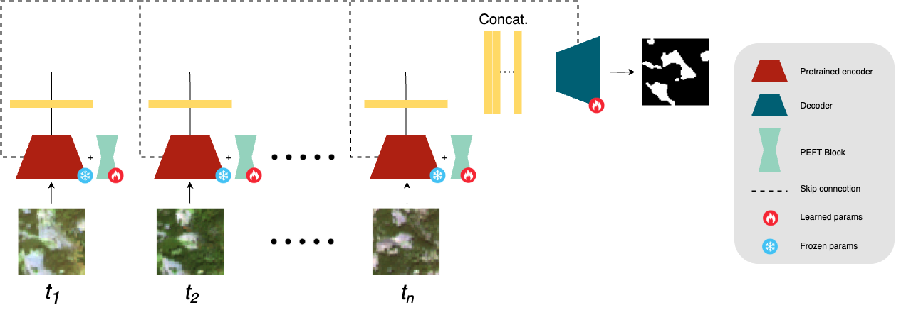

# ULISSE
# Parameter-Efficient Adaptation of Earth Vision Models to Monitor Forest Disturbance in Sentinel-2 Timeseries

[](https://www.python.org/downloads/release/python-3100/)
[](https://pytorch.org/)
[](LICENSE)

## Architecture Overview



## Abstract

This project presents an advanced system for automatic forest damage detection using multi-temporal Sentinel-2 satellite imagery. The framework implements a modified U-Net architecture with a pre-trained ResNet encoder, enhanced by Parameter-Efficient Fine-Tuning (PEFT) techniques such as LoRA, DoRA, and HRA to optimize learning with limited computational resources.

## Introduction

Forest management and monitoring represent crucial challenges in the era of climate change. Extreme events such as storms, fires, and pest infestations cause significant damage to forest ecosystems, requiring rapid and accurate detection systems.

This project leverages:
- **Sentinel-2 imagery** with 10m spatial resolution
- **Multi-temporal analysis** to capture seasonal changes
- **Deep Learning** with efficient architectures
- **XAI (Explainable AI)** to interpret model predictions

### Key Features

- ✅ Support for single-image and time-series analysis
- ✅ Multiple PEFT techniques (LoRA, DoRA, HRA)
- ✅ Integrated explainability with band occlusion analysis
- ✅ Advanced XAI visualizations (polarized maps, scatter plots, boxplots)

## System Requirements

- Python 3.10
- CUDA 12.4+ (for NVIDIA GPUs)
- 16GB RAM minimum (32GB recommended)
- NVIDIA GPU with at least 24GB of vRAM (64GB recommended)
- 50GB available disk space

## Installation

### 1. Clone the Repository

```bash
git clone https://github.com/xxxxx/ULISSE.git
cd ULISSE
```

### 2. Create Virtual Environment

```bash
python3.10 -m venv venv
source venv/bin/activate  # Linux/Mac
# or
venv\Scripts\activate  # Windows
```

### 3. Install Dependencies

```bash
pip install -r requirements.txt
```

### 4. Download Dataset and Pre-trained Models

#### Pre-trained Models

| Resource | Link |
|----------|------|
| Pre-trained Models | [Download here](https://mega.nz/folder/uHwCkYpI#g_PKdl6-apTKhtvTeQOUKg) |

#### Datasets

| Country | Link |
|---------|------|
| Romania | [Download here](https://mega.nz/folder/PXJk0D6b#meh5DzMKnyZZ2mOGTowPcA) |
| Czech Republic | [Download here](https://mega.nz/folder/iXZ3VbiS#HrMOT2L9utVFcq5K-Z1aHw) |

Download and place the files in the directory specified in the configs.


Download and place the files in the directory specified in the configs.

## Project Structure

```
ULISSE/
├── configs/
│   ├── data/
│   │   └── romania/
│   │       ├── september.yaml     # Single image config
│   │       ├── sept-aug.yaml      # 2-month time-series config
│   │       ...
│   │       └── sept-apr.yaml      # 6-month time-series config
│   └── model/
│       ├── single.yaml            # Single month architecture config
│       ├── single_lora.yaml       # Single month with LoRA PEFT config
│       ├── single_dora.yaml       # Single month with DoRA PEFT config
│       ├── single_hra.yaml        # Single month with HRA PEFT config
│       ├── timeseries.yaml        # Timeseries architecture config
│       ├── timeseries_lora.yaml   # Timeseries with LoRA PEFT config
│       ├── timeseries_dora.yaml   # Timeseries with DoRA PEFT config
│       └── timeseries_hra.yaml    # Timeseries with HRA PEFT config
├── src/
│   ├── Data/                      # Dataset management
│   ├── Model/                     # Model architectures
│   ├── Train/                     # Training pipeline
│   └── Utils/                     # Utility functions
├── data/
│   ├── romania/                   # Romania dataset
│   └── models/                    # Pre-trained models
├── results/                       # Result saving directory
├── main.py                        # Entry point
└── requirements.txt
```

## Configuration

### Configuration Files

The project uses two separate YAML files to configure datasets and models.

#### Dataset Configuration (e.g., `configs/data/romania/sept-aug.yaml`)

```yaml
# Base directory
base_dir: "data/romania"
# Dataset and execution identifier tag
dataset_tag: "median_romania"
execution_tag: "sept-aug"

# Reference image input directory for the model
train_images_subdir: "median/2020-09-01 - 2020-09-30/sentinel_2"
test_images_subdir: "median/2020-09-01 - 2020-09-30/sentinel_2"

# Directories of images to add to the time series
additional_images_dirs:
  train:
    - "median/2020-08-01 - 2020-08-31/sentinel_2"
    # ...
  test:
    - "median/2020-08-01 - 2020-08-31/sentinel_2"
    # ...
# Value to map in masks for binary segmentation of damaged pixels
mask_values_map: [1]
# ...
```

#### Model Configuration (e.g., `configs/models/timeseries.yaml`)

```yaml
models:
  resnet50:
    name: "BIFOLD-BigEarthNetv2-0/resnet50-s2-v0.2.0"
    freeze_encoder_after: 10
    encoder_type: "resnet"
    tile_size: 224

execution:
  # Each phase can be enabled/disabled independently
  phases:
    train: true
    test: true
    explain: true

training:
  num_trials: 30
  max_epochs: 200
  # Hyperparameter optimization settings
  rank:
    - 2
    - 4
    - 8
    - 16
    - 32
    - 64
  batch_size:
    - 4
    - 8
    - 16
    - 32
    - 64
  # Early stopping and optimization metric
  early_stopping_patience: 20
  optimization_metric: "f1_class1" # "f1_class1" - "loss"
  num_workers_dl: 8
  output_dir: "opt_by_f1_div_10k_optimized/timeseries"
  device: "cuda"
  # Tile size for tiling during phases
  tile_size: 224

  # PEFT settings
  peft_encoder: false # "lora" - "dora" - "hra" - false
  fusion_mode: middle # (only for timeseries)
  fusion_technique: concat # "sum" - "concat" - "diff" (only for timeseries)

  mode: "segmentation" # "segmentation"
  temporal_mode: "timeseries" # "single" - "timeseries"

  # Fine-tuning settings
  freeze_encoder_after: 200
  freeze_encoder: false
```

## Usage

### Single-Image Mode

To run training on single images:

```bash
python main.py \
  --data_config configs/data/romania/september.yaml \
  --model_config configs/model/single.yaml \
  --model resnet50
```

Make sure that:
```yaml
training:
  temporal_mode: "single"
```

### Time-Series Mode (2 images)

```bash
python main.py \
  --data_config configs/data/romania/sept-aug.yaml \
  --model_config configs/model/timeseries.yaml \
  --model resnet50
```

Make sure that:
```yaml
training:
  temporal_mode: "timeseries"

# And in the data config:
additional_images_dirs:
  train:
    - "median/2020-08-01 - 2020-08-31/sentinel_2"
```

### Time-Series Mode (6 images)

```bash
python main.py \
  --data_config configs/data/romania/sept-apr.yaml \
  --model_config configs/models/timeseries.yaml \
  --model resnet50
```

### Execution Phase Control

In the `configs/models/resnet_models.yaml` file, you can enable/disable different phases:

```yaml
execution:
  phases:
    train: true    # Model training
    test: true     # Test set evaluation
    explain: false # XAI analysis (requires trained model)
```

#### Training Only

```yaml
execution:
  phases:
    train: true
    test: false
    explain: false
```

#### Testing Only (requires existing checkpoint)

```yaml
execution:
  phases:
    train: false
    test: true
    explain: false
```

#### Explainability Only

```yaml
execution:
  phases:
    train: false
    test: false
    explain: true
```

### PEFT Techniques

Choose the fine-tuning technique by modifying:

```yaml
training:
  peft_encoder: "lora"  # Options: lora, dora, hra, false
  rank: # Rank values to optimize
    - 2
    - 4
    - 8
    - 16
    - 32
    - 64
```

**Available options:**
- `lora`: Low-Rank Adaptation
- `dora`: Weight-Decomposed Low-Rank Adaptation
- `hra`: Householder Reflection Adaptation
- `false`: Full fine-tuning (requires more resources)

### Fusion Strategies (Time-Series)

```yaml
training:
  fusion_mode: "middle"         # late, middle
  fusion_technique: "concat"    # sum, concat, diff
```

**Fusion Techniques:**
- `sum`: Feature summation
- `concat`: Concatenation + 1x1 conv compression
- `diff`: L2-normalized difference

## Output

Results are saved in `results/{dataset_tag}/{output_dir}/`:

```
results/
└── median_romania/
    └── resnet50_unet_sept-aug/
        ├── checkpoints/              # Model checkpoints
        ├── metrics/                  # CSV with metrics
        ├── predicted_images/         # Predicted masks
        │   ├── images/              # RGB visualizations
        │   └── tifs/                # Georeferenced GeoTIFFs
        ├── xai_band_occlusion_0/    # XAI analysis (zero occlusion)
        ├── xai_band_occlusion_avg/  # XAI analysis (mean occlusion)
        ├── polarized_xai/           # Polarized XAI maps
        └── consolidated_scatters/   # f_plus vs f_minus scatter plots
```

## Explainability (XAI)

### Band Occlusion Analysis

XAI analysis evaluates the importance of each spectral band:

```yaml
execution:
  phases:
    explain: true
```

Generates:
- **XAI maps per band**: Spatial importance
- **Polarized visualizations**:
  - 🔵 Blue = important for healthy pixels (GT=0)
  - 🔴 Red = important for damaged pixels (GT=1)
- **Scatter plots**: f_plus vs f_minus per band
- **Boxplots**: Value distribution by class

### XAI Results Interpretation

#### f_plus vs f_minus

- **f_plus**: Probability with all bands present
- **f_minus**: Probability with occluded band

**For healthy pixels (GT=0):**
- Points above diagonal (f_minus > f_plus) → band important for detecting health

**For damaged pixels (GT=1):**
- Points below diagonal (f_minus < f_plus) → band important for detecting damage

## Citation

If you use this code, please cite:

```bibtex
@article{papername2025ulisse,
  title={ULISSE: Parameter-Efficient Adaptation of Earth Vision Models to Monitor Forest Disturbance in Sentinel-2 Timeseries},
  author={...},
  journal={...},
  year={2025}
}
```

## License

This project is released under the MIT License. See the [LICENSE](LICENSE) file for details.

## Acknowledgments

- Sentinel-2 dataset provided by the Joint Research Centre Data Catalogue and extracted from DEFID2 (https://data.jrc.ec.europa.eu/dataset/6b2a1a59-5f8a-4bd4-9570-da967f45fd2b)
- Pre-trained encoder from [RSiM, TU Berlin](https://huggingface.co/BIFOLD-BigEarthNetv2-0)
- PEFT implementations from Hugging Face [peft](https://github.com/huggingface/peft)

---